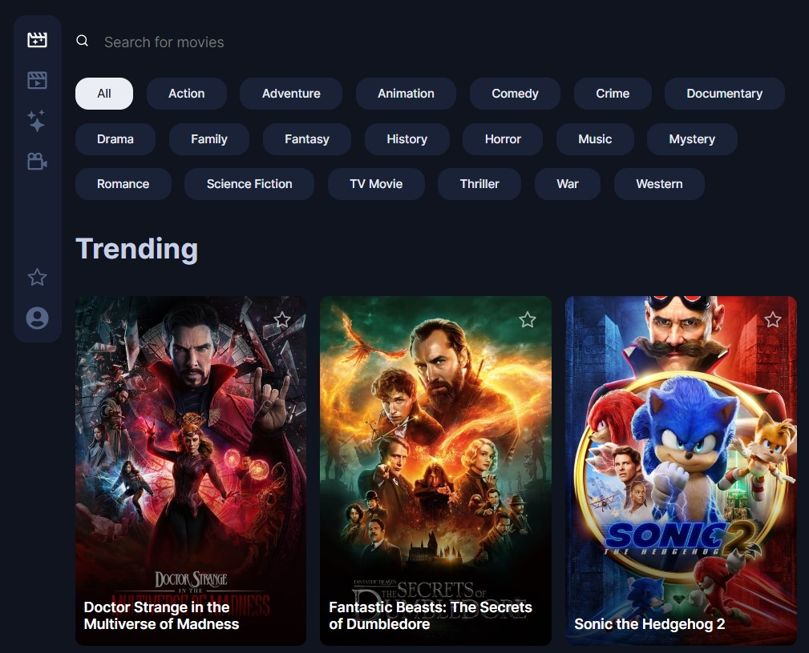

## General info

I built a movie application with React JS (MERN Stack).
The app helps you search for a movie,watch online movie and read information about a movie, and check the rating.
The application uses the local memory of the browser to save your favourites film.
Smooth filtering of the movie category is possible thanks to framer motion library.





## Live site

[MOVIE-APP](https://sudomovies.ml/)

## Technologies

Project is created with:

- MongoDB
- Context API
- Framer motion
- React Icons
- React Hooks
- React Router
- The Movie Database (TMDB) API

## Requirement

- MongoDB
- Node.js

## Setup

To run this project, install it locally using npm:

```
$ cd SudoMovies
$ npm install
$ npm start
$ cd Backend
$ npm install
$ npm run nodemon
```
